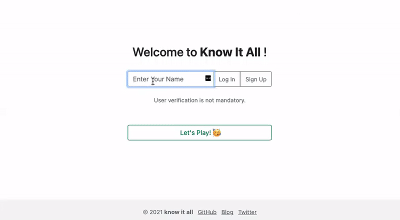
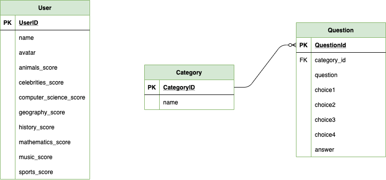
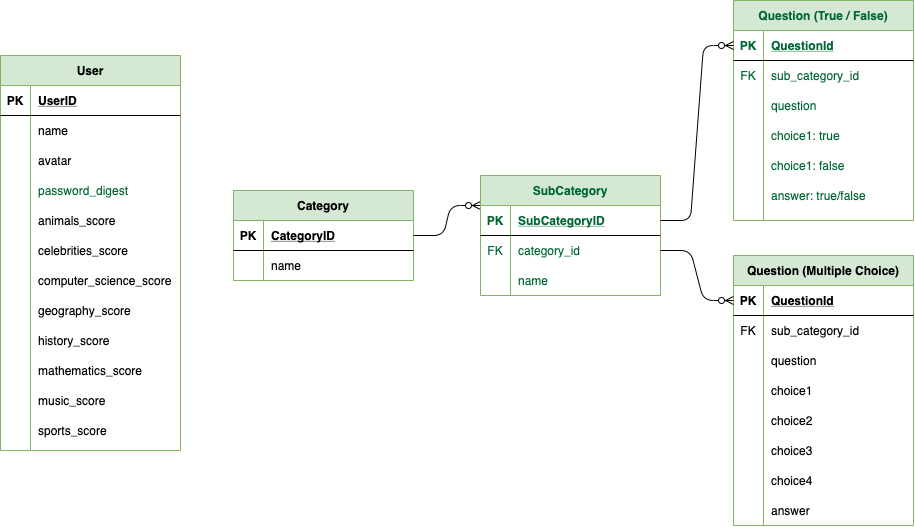

# Know It All :: Front-End

<div align="center">
  
</div>

<br>

<strong>Domain Modeling :: Trivia Games</strong><br>
Welcome to my simplistic version of Online Trivia Games.<br> 

<p><a href="https://github.com/fentyhall/KnowItAll_backend">Back-End GitHub Repo</a></p>
<p><a href="https://youtu.be/kU_Ay68TWcM">YouTube Demo</a></p>
<p><a href="https://dev.to/codinghall/know-it-all-2kpp">DEV Blog</a></p>

## About

<p>I dedicate this project for my husband, who loves trivia very much, and cooked the past two weeks while I was working diligently on this project.</p>
<p>The Minimum Viable Product (MVP) of <strong>Know It All</strong> is to provide the User with few trivia Categories to select from.</p>

## Features

<div align="center">
  
</div>

<br>

**Models** <br>
User, Category<br>

> user `has_many` :categories<br>

> category `belongs_to` :user<br>

**Controller** <br>
ApplicationController<br>
UsersController<br>
CategoriesController<br>
QuestionsController<br>

## API Database

- [x] <a href="https://opentdb.com/">Open Trivia Database</a>

> Free to use, user-contributed trivia question database.

## Installation

<strong>Back-End</strong>

```ruby
$ git clone 👾
$ bundle install
$ rails db:create && rails db:migrate
$ rails db:seed
$ rails s
```

Open Chrome browser, and redirect to 'http://localhost:3000' to start the Rails API.

<strong>Front-End</strong>
<p>Open Chrome browser, and redirect to 'http://127.0.0.1:5500/index.html' to start the app.</p>

## Build Status and Future Improvement
<p>Current project-built was completed in a 2-week timeframe from API data search, model association development, and MVP for the user interface. Future cycle of product development as follows:</p>

- [x] Add `Sub Category` to model associations. 
- [x] Outsource additional APIs for more `Sub Category` content.
- [x] Gather user inputs on their most favorite `Category` for future app improvement.
- [x] Utilizing `setInterval` for 20 seconds on each Trivia question.
- [x] User authentication.
- [x] Create toggle track for `dark mode` 😎

<strong>Future Project Build ERD</strong><br>

<div align="center">
  
</div>

<br>

## Stack
- [x] Active Record
- [x] Rack CORS
- [x] PostgreSQL
- [x] Fast JSON API 
- [x] REST Client
- [x] Open-URI
- [x] Nokogiri
- [x] Bootstrap v5.0

## Resources

- [x] <a href="https://opentdb.com/">Open Trivia Database</a>
- [x] <a href="https://getbootstrap.com/">MaterializeCSS</a>